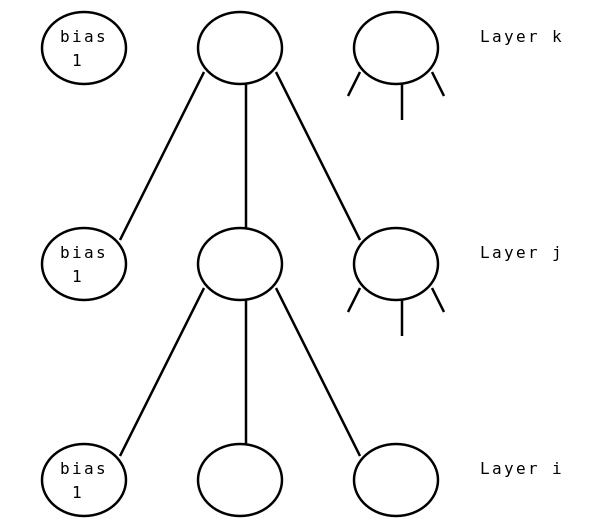

# ann

A fast neural networks computing golang package.

For now, only a feedforward perceptron multi-layer architecture is implemented.

For easier computation purposes, a bias neuron is introduced in the neural network layers.
The standard notation is used in the backpropagation algorithm:
k index for the upper layer
j index for the intermediate layer
i index for the bottom layer  

TODO:
- Add the backpropagation algorithm
- Add functional testing for the perceptron using cosinus or sinus function to approximate for example.
